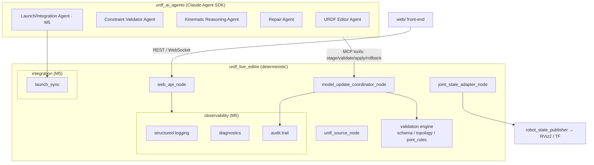

# Architecture

The project is a two-package `colcon` workspace plus a web front-end and this
documentation site.

```
src/
  urdf_live_editor/     # deterministic robotics core (no LLM dependency)
  urdf_ai_agents/       # Claude Agent SDK layer
web/                    # browser front-end (editing + visualization)
docs/                   # this documentation site
models/                 # sample robots for demos and tests
```

The hard boundary between the two packages is deliberate: `urdf_live_editor` is
pure, deterministic robotics code, and `urdf_ai_agents` may only reach the model
through the *same* staged-edit and validation interfaces a human uses. This is
what guarantees the AI layer cannot bypass validation.

## Component map



## The staged-edit pipeline

Every edit — whether it originates from a file change, a REST call, the web UI,
or a natural-language instruction to an agent — follows the same path:

1. The edit is expressed as one or more structured `EditOperation`s.
2. A **staged candidate** model is produced (the live model is untouched).
3. **Deterministic validation** runs on the candidate (authoritative).
   AI-assisted validation may add explanations and suggested repairs, but never
   overrides the deterministic result.
4. If valid, the candidate is applied: `robot_description` is republished,
   downstream state refreshes, a new immutable version is stored, and an audit
   entry is appended.
5. If invalid, the change is rejected and the caller receives a
   `ValidationResult` with diagnostics and `suggested_repairs`.

## Milestone 5 additions

Milestone 5 hardens the system for real use. The four deliverables and where
they live:

| Deliverable | Location |
|---|---|
| Web front-end (editing + visualization + audit viewer) | `web/` |
| Launch/Integration Agent (launch/config sync) | `src/urdf_ai_agents/urdf_ai_agents/agents/launch_integration_agent.py` over `src/urdf_live_editor/urdf_live_editor/integration/launch_sync.py` |
| Structured logging, diagnostics, audit trail | `src/urdf_live_editor/urdf_live_editor/observability/` |
| Documentation site | `docs/` (this site) |

### Observability

Three cooperating, ROS-independent building blocks (see
[Observability reference](reference/observability.md)):

- **Structured logging** emits one JSON object per event with bound context, so
  logs are greppable and streamable to the web UI.
- **Diagnostics** aggregates per-subsystem health (`OK`/`WARN`/`ERROR`/`STALE`,
  mirroring `diagnostic_msgs`) into a single dashboard snapshot.
- **Audit trail** is an append-only, hash-chained log of applied changes
  (who / what / when / diff / version), so tampering is detectable and every
  change is traceable.

### Launch/Integration sync

When the model changes, non-model artifacts (per-joint policy/config files,
launch references to RViz and controller configs) can drift out of sync. The
deterministic planner in `integration/launch_sync.py` computes exactly what must
change; the Launch/Integration Agent explains and, on request, applies that
plan. The agent can never invent a change the planner did not authorize. See the
[Launch/Integration reference](reference/launch-integration.md).

## Testing strategy

- **Unit tests (`pytest`)** for the deterministic core, observability, and
  launch-sync — all run offline, gating every commit.
- **Node unit tests (`node --test`)** for the web front-end's pure modules.
- **Browser smoke test (Playwright)** drives the real page end-to-end.
- **Integration tests (`launch_testing`)** and **golden-model tests** cover the
  ROS nodes and known-good/known-broken URDFs (Milestones 1–3).
- **Recorded-response tests** keep the AI layer deterministic in CI without live
  API calls (Milestone 4).
