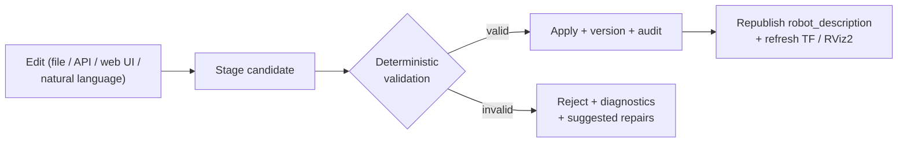

# ROS 2 Live URDF Editor with AI Agents

Welcome to the documentation for the **ROS 2 Live URDF Editor** — a project for
live editing, validation, and visualization of URDF/Xacro robot models, with an
AI-agent layer built on the Claude Agent SDK.

The system is split into a **deterministic robotics core** and an **AI-assisted
reasoning layer** so that invalid edits can never directly mutate the active
model. Every change flows through the same staged pipeline:



## What this documentation covers

This site is the Milestone 5 documentation deliverable. It focuses on the pieces
that make the system usable and robust in practice:

- **[Architecture](architecture.md)** — how the deterministic core, AI layer,
  observability, and web UI fit together.
- **Reference**
    - **[Observability](reference/observability.md)** — structured logging,
      diagnostics, and the auditable, hash-chained change trail.
    - **[Launch/Integration sync](reference/launch-integration.md)** — how the
      Launch/Integration Agent keeps launch and config files in step with the
      model.
    - **[Validation rules](reference/validation-rules.md)** — the exact,
      authoritative rules the deterministic engine enforces.
- **Tutorials** — get the stack running, make your first live edit, drive the
  [web UI](tutorials/web-ui.md), and keep launch/config in sync.

## Guiding principles

1. **Deterministic core first.** Every AI capability sits on top of a robotics
   core that is fully testable without any API access. The AI layer can never
   bypass validation.
2. **Staged edits only.** Nothing mutates the active `robot_description` until it
   has passed deterministic validation on a staged candidate.
3. **Everything is auditable.** Every applied change produces a versioned diff
   and a tamper-evident audit entry.
4. **Ship testable slices.** Each milestone ends with something runnable and
   covered by tests.

## Building this site

```bash
pip install -r docs/requirements.txt
mkdocs serve      # live preview at http://127.0.0.1:8000
mkdocs build      # static site into ./site
```
