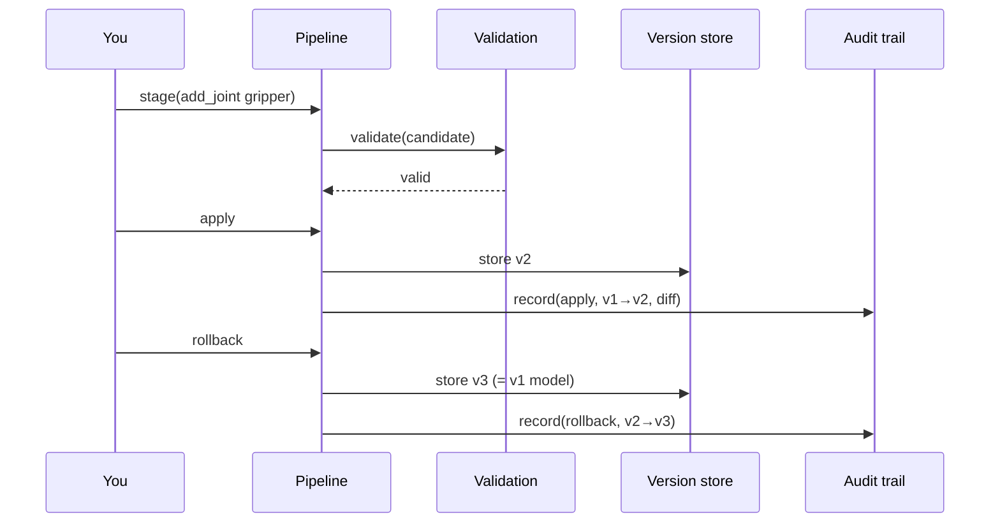

# Your first live edit

This tutorial walks through adding a joint to the sample arm and watching it flow
through the staged-edit pipeline: **stage → validate → apply → audit → rollback**.

We use the web UI's offline mock backend so no ROS or API key is needed; the same
steps map directly onto the REST API and the ROS nodes.

## 1. Open the editor

```bash
cd web && python3 server.py
```

Open <http://127.0.0.1:8080>. The sample arm loads as version `v1`:
`base_link → shoulder → link_1 → elbow → link_2 → wrist → link_3`, with a fixed
`tool_mount` to `tool_link`. The **Visualization** panel shows the kinematic
tree, movable joints in color.

## 2. Stage a new joint

In **Quick edit operation**, add a gripper:

| Field | Value |
|---|---|
| Operation | `add_joint` |
| Name | `gripper` |
| type | `revolute` |
| parent | `link_3` |
| child | `gripper_link` |
| axis | `0 0 1` |
| lower | `-0.5` |
| upper | `0.5` |

Click **Stage operation**. The **Staged validation** panel shows
*✓ passes deterministic validation* and the **Apply staged** button enables. The
child link `gripper_link` is auto-created.

!!! tip "Try an invalid edit"
    Stage a `revolute` joint with no `lower`/`upper`. Validation fails with
    `MISSING_LIMIT` and offers a **Suggested repair** button that stages
    symmetric limits for you. Apply stays disabled until the candidate is valid —
    the pipeline never lets an invalid model through.

## 3. Apply

Click **Apply staged**. The model advances to `v2`, the visualization now shows
`gripper`, and a new **Audit trail** entry appears:

```
human:web · APPLY
+ joint gripper (revolute); + link gripper_link
#1 · <timestamp> · v1→v2 · hash a1b2c3d4…
```

## 4. Verify the audit trail

On the **Audit trail** tab, click **Verify integrity**. The viewer recomputes the
hash chain and reports *✓ audit trail intact*. This is the same tamper-evidence
the Python `AuditTrail.verify()` provides server-side.

## 5. Roll back

Click **Rollback**. The editor returns to the `v1` structure (no gripper) as a new
version `v3` — rollback is itself an auditable, forward-moving change, not a
deletion of history.

## What just happened



The same flow is available over the REST API (`POST /api/stage`,
`/api/validate`, `/api/apply`, `/api/rollback`) and to the AI agents through MCP
tools — all routing through the identical deterministic validation.
